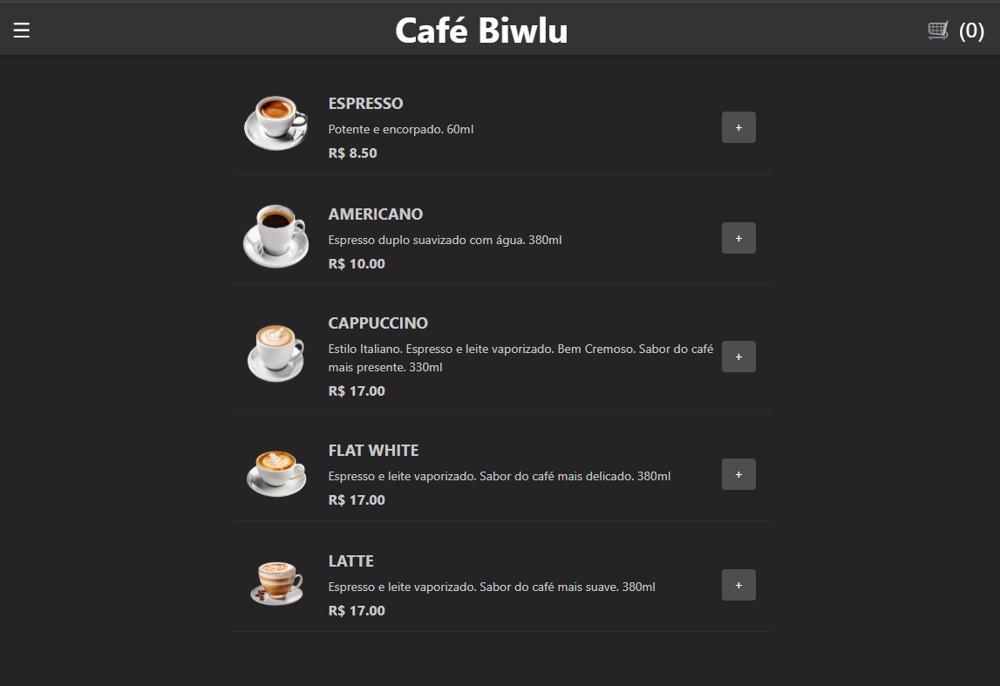
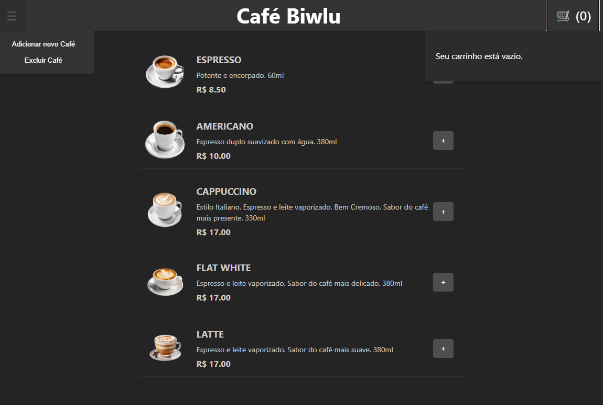
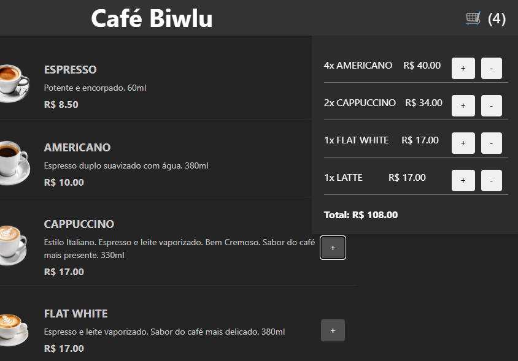

# Cafeteria com Carrinho - Aplicação Frontend


Essa aplicação foi feita usando **React e Typescript.**

Essa página de uma Cafeteria usando um Cart foi desenvolvida para meu portfolio, para demonstrar conhecimento em Frontend com React, React Query, Typescript e integração com o Backend.

## Funcionalidades

>

- `Pagina principal` contendo uma lista de café adicionados.
<h1 align="center">
    
</h1


- `Um Header` com um menu na esquerda para adicionar e excluir produtos e na direita um carrinho.
<h1 align="center">
    
</h1>


- `Adicionar ao Carrinho` um botão que ao clicar adiciona um item ao carrinho.
<h1 align="center">
    
</h1>


## Instalação

1. Clone o repositorio:

```bash
git clone https://github.com/JustinoLucas/React-TS-Coffe.git
cd React-TS-Coffee
```

2. Para instalar as dependências, execute o seguinte comando:
```bash
npm install

npm install @tanstack/react-query

npm install axios
```

3. Executando o projeto:
```bash
npm run dev
```

## Integração com Backend

Para realizar a integração com o Backend, você pode clonar o projeto e rodar localmente, ou desenvolver você mesmo

[Link do repositório](https://github.com/JustinoLucas/coffe-api-rest)


